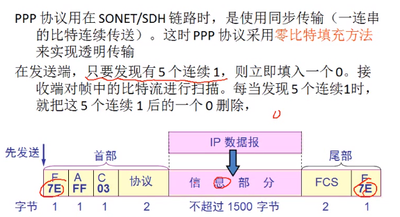
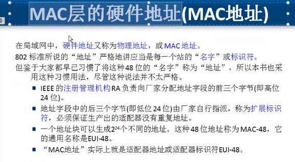
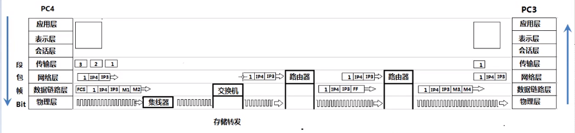
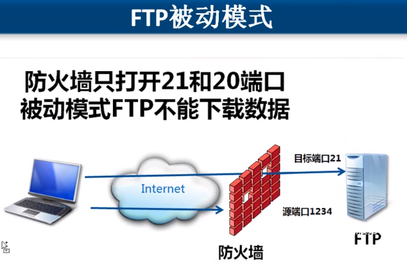

### 写在前面

这是我的个人笔记，也是我第一次使用代码托管平台向各位分享，希望对大家有所帮助。同时也要谢谢**韩立刚**老师，是他用生动形象的教学让我学会了计算机网络，在此向**韩老师**致敬。

# 计算机网络

[TOC]

## 第一章：计算机网络概述

### 局域网

### 规划ip地址

### 访问网站数据传输过程

### OSI参考模型

- 应用层：所有能产生网络流量的程序
- 表示层：在传输之前是否进行加密或压缩处理 二进制ASCII码
- 会话层：查木马等 netstate -n
- 传输层：可靠传输、流量控制、不可靠传输
- 网络层：负责选择最佳路径 规划ip地址
- 数据链路层：帧的开始和结束 透明传输 差错校验
- 物理层：网络设备接口标准，电气标准

### 理解OSI参考模型分层思想

- 每一层的改变不会影响其他层

### OSI参考模型对网络排错的指导

#### 1.物理层故障：查看连接状态，发送和接收的数据包

#### 2.数据链路层故障：MAC冲突 ADSL欠费 网速没办法协商一致 计算机连接到错误的VLAN

#### 3.网络层故障：配置错误的IP地址 子网掩码 配置错误的网关 路由器没有配置到达目标网络的路由

#### 4.应用层故障：应用程序配置错误

### OSI参考模型和网络安全

#### 1.物理层安全

#### 2.数据链路层安全 ADSL 账号密码 VLAN交换机端口绑定MAC地址

#### 3.网络层安全：网络层安全 在路由器上使用ACL控制数据包流量

#### 4.应用层安全 开发的应用程序没有漏洞

### OSI参考模型和TCP/IP协议

### 计算机网络性能指标

#### 1.速率：连接在计算机网络上的主机在数字信道上传送**数据位数**的速率，也称为data rate或bit rate。单位是b/s,kb/s,Mb/s,Gb/s。（二进制的一位叫做1bit）（指的是在一个信道上的数据流量速率）

#### 2.带宽：数字通信领域中数字信道所能传送的最高数据率，单位同上

#### 3.吞吐量：在单位时间内通过某个网络的数据量，单位同上，如下图所示，左边到中间的计算机100M带宽当前网速为15M，即15M为通过该网络的数据量，总流量

#### 4.时延：分为发送时延、传播时延、处理时延、排队时延

- 发送时延：值从开始发送数据到发送结束的时间，**发送时延=数据块长度(比特)/信号带宽(比特/秒)**
- 传播时延：在网线上传送数据的时间
- 处理时延：路由器可能会同时传送着很多数据，先到达的数据先进行处理分析以确定传送到哪里，分析处理所花费的时间即为处理时延
- 排队时延：路由器可能会同时传送着很多数据，先到达的数据优先处理，后到达的必须要等待前一条数据处理完成才能轮到处理，在等待过程中所花费的时间即为排队时延

#### 5.时延带宽积：时延带宽积=传播时延*带宽，指的是当前有多少数据在线路上

#### 6.往返时间(RTT)：从发送方发送数据开始到发送方收到接受方确认，可以使用ping命令测试

#### 7.利用率：

- 信道利用率=有数据通过的时间/（有+无）数据通过的时间
- 网络利用率=信道利用率加权平均值

## 第二章：物理层

### 2.1 物理层的基本概念

物理层解决如何在连接各种计算机的传输媒体上传输数据比特流，而不是指具体的传输媒体。

物理层的主要任务描述为：确定传输媒体的接口的一些特性，即：

- 机械特性：接口形状，大小，引线数目
- 电气特性：例如规定电压范围（-5v到+5v）
- 功能特性：例如规定-5v表示0，+5v表示1
- 过程特性：也称规程特性，规定建立连接时各个相关部件的工作步骤

### 2.2数据通信的基础知识

#### 通信的目的是传送消息

- 数据（data）—— 运送消息的实体
- 信号（signal）—— 数据的电气或电磁的表现
- “模拟信号”—— 代表消息的参数的取值是连续的。
- “数字信号”—— 代表信息的参数的取值是离散的。
- 码元（code）—— 在使用时间域的波形表示数字信号时，则代表不同离散数值的基本波形就成为码元。在数字通信中常常用时间间隔相同的符号来表示一个二进制数字，这样的时间间隔内的信号称为二进制码元。而这个间隔被称为码元长度。1码元可以携带nbit的信息量。

#### 有关信道的几个基本概念

- 单向通信（单工通信）—— 只能有一个方向的通信而没有反方向的通信（卫星电视）
- 双向交替通信（半双工通信）—— 通信的双方都可以发送信息但是不能同时发送，也不能同时接收。（对讲机）
- 双向同时通信（全双工通信）—— 通信的双方可以同时发送和接收消息。（打电话）

#### 基带（baseband）信号和带通（band pass）信号

- 基带信号（基本频带信号）—— 来自信源的信号，比如说话的声音，未经过处理的信号等。

- 带通信号 —— 把基带信号经过载波调制后，将信号的频率范围搬移到较高的频段以便在信道中传输（即仅在一定频率范围内能够通过信道）

- 传输距离近使用**基带信号**传输，因为信号衰减不大，传输距离远使用**带通信号**传输。

- 

- 编码方式：单极性和双极性：电压是否有正负；归零与不归零：信号为1时电压是否有归零的时间段

  

  

  

#### 信道极限容量

#### 奈氏准则

在理想的条件下，为了避免码间串扰，码元的传输速率具有上限值。在任何信道中，码元传输的速率是有上限的，否则就会出现码间串扰的问题，使接收端对码元的判决（即识别）成为不可能。

如果信道的频带越宽，也就是能够通过的信号高频分量越多，那么就可以用更高的速率传送码元而不出现码间串扰。

#### 信噪比

香农用信息论的理论推导出了带宽受限且有高斯白噪声干扰的信道的**极限**、**无差错**的信息传输速率。
$$
C=W\log_2(1+S/N)
$$

- W为信道的带宽（以**Hz**为单位）；
- S为信道内所传信号的平均功率；
- N为信道内部的高斯噪声功率。

### 2.3 物理层下面的传输媒体

#### 导向传输媒体

导向传输媒体中，电磁波沿着固体媒体传播。

双绞线

- 屏蔽双绞线STP
- 无屏蔽双绞线UTP

同轴电缆

- 50Ω同轴电缆：用于数字传输，由于多用于基带传输，也叫基带同轴电缆；
- 75Ω同轴电缆：用于模拟传输，即宽带同轴电缆

光缆

#### 各种电缆：

#### 网线、交叉电缆

目前设备网卡可以自动协商收发线，因此无需交叉

#### 光纤

#### 非导向传输媒体

#### 物理层设备——集线器

### 2.4 信道复用技术

**复用**（multiplexing）是通信技术中的基本概念

#### 频分复用FDM

相当于channel，也就是频道

多种信号叠加，传递之后使用不同的过滤器就可以解调到不同的数据

#### 时分复用TDM

#### 统计时分复用STDM

（有点像哈夫曼树）

#### 波分复用WDM

### 2.5 数字传输系统

### 2.6 宽带接入技术

DMT将并行数据转换为串行

## 第三章：数据链路层

### 3.1 数据链路层的基本概念（数据链路层的简单模型）

#### 数据链路层的信道类型

- 点对点信道：这种信道使用一对一的点对点通信方式
- 广播信道：这种信道使用一对多的广播通信方式

#### 链路（link）是一条点到点的物理线路段，中间没有任何其他的交换节点

- 一条链路只是一条通路的一个组成部分

#### 数据链路（data link）除了物理线路外，还必须有通信协议来控制这些数据的传输。若把实现这些协议的硬件和软件加到链路上，就构成了数据链路。

- 现最常用的方法是使用适配器（即网卡）来实现这些协议的硬件和软件。
- 一般的适配器都包括了数据链路层和物理层这两层功能。

数据链路层传送的是帧

帧包含：帧头、帧尾、物理层地址、校验值

### 3.2 数据链路层的基本问题

#### 1.封装成帧

- 封装成帧就是在一段数据的前后分别添加头部和尾部，然后就构成了一个帧。确定帧的界限。
- 首部和尾部的一个重要作用就是进行帧定界。

#### 2.透明传输

字节填充，防止误会，转义符号ESC，相当于反斜杠

#### 3.差错检测

- 什么是差错检测？

  传输过程中可能会产生比特差错：1可能变成0，0可能变成1，在一段时间内，传输错误的比特占所传输比特总数的比率成为**误码率**BER（Bit Error Rate）。

  **误码率**和**信噪比**有很大关系，为了保证数据传输的可靠性，在计算机网络传输数据时，必须采用各种差错检验措施。

- 如何检验？（不太会）

  

### 3.3 使用点对点的数据链路层

#### PPP协议

PPP协议应该满足的要求：

- 简单
- 封装成帧
- 透明性
- 多种网络层协议
- 多种典型链路
- 差错检测
- 检测连接状态
- 最大传送单元
- 网络层地址协商
- 数据压缩协商

PPP协议不需要满足的要求

- 纠错
- 流量控制
- 序号
- 多点线路
- 半双工或单工链路

#### PPP协议的组成

1. 数据链路层协议可以用于异步串行或同步串行介质。

2. 它使用LCP（链路控制协议）建立并维护数据链路连接。

3. 网络控制协议（NCP）允许在点到点上使用多种网络协议，如图所示。

   

   也就是说PPP协议包含了2的三种协议

#### PPP协议帧格式

#### PPP协议不使用序号和确认机制

PPP协议之所以不使用序号和确认机制是出于以下的考虑：

- 在数据链路层出现差错的概率不大时，使用比较简单的PPP协议较为合理。
- 在因特网环境下，PPP的信息字段放入的数据时IP数据包。数据链路层的可靠传输并不能够保证网络层的传输也是可靠的。
- 帧检验序列FCS字段可保证无差错接受。

### 3.4 使用广播信道的数据链路层

#### 局域网的拓扑

#### 共享通信媒体

静态划分信道：

- 频分复用
- 时分复用
- 波分复用
- 码分复用

动态媒体接入控制（多点接入）

- 随机接入（主要被以太网采用）
- 受控接入，如多点线路探询（polling），或轮询。（目前已不被采用）

集线器和总线的通信都具有广播特性

#### 载波监听多点接入/碰撞检测 以太网使用CSMA/CD协议

CSMA/CD表示Carrier Sense Multiple Access with Collision Detection。

- “多点接入”表示许多计算机以多点接入的方式连接在一根总线上。
- “载波监听”是指每一个站在发送数据之前要检测一下总线上是否有其他计算机在发送数据，如果有则暂时不要发送数据，以免发生碰撞。
- “载波监听”就是用电子技术检测总线上有没有其他计算机发送的数据信号。

#### 碰撞检测

“**碰撞检测**”就是计算机边发数据边检测信道上的信号电压大小。

- 当几个站同时在总线上发送数据时，总线上的信号电压摆动值将会增大（互相叠加）。
- 当一个站点检测到的信号电压摆动值超过一定的门限值时，就认为总线上至少有两个站同时在发数据，表明产生了**碰撞**。
- 所谓“碰撞”就是发生了冲突。因此“碰撞检测”也称为“**冲突检测**”。

**检测到碰撞后**

- 在发生碰撞时，总线上传输的信号产生了严重的失真，无法从中恢复出有用的信息来。
- 每一个正在发送数据的站，一旦发现总线上出现了碰撞，就要立即停止发送，免得继续浪费网络资源，然后等待一段随机时间后再次发送。

#### 传播时延对载波监听的影响

使用CSMA/CD协议的以太网不能进行全双工通信而只能交替通信（半双工通信）。

每个站在发送数据之后的一小段时间内，存在着遭遇碰撞的可能性。

这种**发送的不确定性**使整个以太网的平均通信量远小于以太网的最高数据率。

#### 争用期

最先发送数据帧的站，在发送数据帧后至多经过时间2t（2倍的端到端往返时延）就可知道发送的数据帧是否遭受了碰撞。

经过争用期这段时间还没有检测到碰撞，才能肯定这次发送不会发生碰撞。

以太网的争用期

- 以太网的端到端往返时延2t称为争用期，或碰撞窗口。通常，取**51.2us**为争用期的长度。
- 对于10Mb/s以太网，在争用期内可发送**512bit**，即**64**字节。
- 以太网在发送数据时，若前64字节未发生冲突，则后续的数据就不会发生冲突。

最短有效帧长

- 如果发生冲突，就一定是在发送的前64字节之内。
- 由于一检测到冲突就立即停止发送，这时已经发送出去的数据一定小于64字节。
- 以太网规定了最短有效帧长为64字节，凡长度小于64字节的帧都是由于冲突而异常终止的无效帧。

#### 二进制指数类型退避算法

发生碰撞的站在停止发送数据后，要推迟（退避）一个随机时间才能再发送数据。

- 确定基本避退时间，一般是取为争用期2t。

- 定义参数k
  $$
  k = Min[重传次数, 10]
  $$
  
- 从整数集合[0,1,...,(2^k-1)]中随机的取出一个数，记为r。重传所需的时延就是r倍的**基本避退时间**。
- 当重传达16次仍不能成功时即丢弃该帧，并向高层报告。

### 3.5 以太局域网（以太网）

#### 3.5.1 概念

DIX Ethernet V2是世界上第一个局域网产品（以太网）的规约。

IEEE的802.3标准。

DIX Ethernet V2与IEEE的802.3标准只有很小的差别，因此可以将802.3局域网简称为“**以太网**”。

严格说来，“以太网”应当是指符合DIX Ethernet V2标准的局域网

##### 以太网与数据链路层的两个子层

为了使数据链路层能更好地适应多种局域网的标准，802的委员会就将局域网的数据链路层拆成两个子层：

- 逻辑链路控制LLC（Logical Link Control）子层
- 媒体接入控制MAC（Medium Access Control）子层。

与接入到传输媒体有关的内容都放在MAC子层，而LLC子层则与传输媒体无关，不管采用何种协议的局域网对LLC子层来说都是透明的。

由于TCP/IP体系经常使用的局域网是DIX Ethernet V2而不是802.3标准中的几个局域网，因此现在802委员会制定的逻辑链路控制子层（即802.2标准）的作用已经不大了。

很多厂商生产的适配器上就仅装有MAC协议而没有LLC协议。

##### 以太网提供的服务

以太网提供的是不可靠的交付，尽最大努力的交付。

当接收站收到有差错的数据帧时就丢弃此帧，其他什么也不做。差错的纠正由高层来决定。

如果高层发现丢失了一些数据而进行重传，但以太网并不知道这是一个重传的帧，而是当作一个新的数据帧来发送。

#### 3.5.2 拓扑

##### 星型拓扑

##### 集线器的一些特点

##### 10Base-T

#### 3.5.3 信道利用率

##### 以太网的信道利用率

以太网信道被占用的情况：

争用期长度为2t，即端到端传播时延的2倍。检测到碰撞后不发送干扰信号。

帧长为L（bit），数据发送速率为C（b/s），因而帧的发送时间为
$$
L/C = T_0(s)
$$

##### 以太网信道利用率：参数a

- 要提高以太网的信道利用率，就必须减少t和T0之比。在以太网中定义了参数a，它是以太网单程端到端时延t与帧的发送时间T0之比：

$$
a = t/T_0
$$

- a趋近于0表示一发生碰撞就可以立即检测出来，并立即停止发送，因而信道利用率就很高。
- a越大，表明争用期所占的比例增大，每发生一次碰撞就浪费许多信道资源，使得信道利用率明显降低。

##### 以太网的信道利用率：最大值

对以太网的要求

- 当数据率一定时，以太网的连线的长度会受到限制，否则t的数值会太大
- 以太网的帧长不能太短，否则$T_0$的值会太小，使a值太大。

信道利用率的最大值

- 在理想化的情况下，以太网上的各站发送数据都不会产生碰撞（这显然已经不是CSMA/CD，而是需要使用一种特殊的调度方法），即总线一旦空闲就有某一个站立即发送数据。

- 发送一帧占用线路的时间是$T_0+t$，而帧本身的发送时间是$T_0$。于是我们可计算出理想情况下的极限信道利用率$S(max)$为：
  $$
  S(max) = T_0/(T_0+t)=1/(1+a)
  $$

#### 3.5.3 MAC层

##### MAC层的硬件地址（MAC地址）

##### 适配器检查MAC地址

##### MAC帧格式

 常用的以太网MAC帧格式有两种标准：

- DIX Ethernet V2标准
- IEEE的802.3标准

最常用的MAC帧是**以太网V2的格式**。

无效的MAC帧

帧间最小间隔

### 3.6 扩展以太网

在物理层考虑扩展

距离上的扩展

数量上的扩展

集线器级联就可以使网络中计算机的数量增加，但是效率变低，组建了一个重大的冲突域

#### 优化

在数据链路层考虑扩展

**网桥**可以通过学习记住哪个计算机对应哪边的口，因此再次发送时就只会定向发送不影响其他口通信，后来**网桥**就发展成了**交换机**。

因此交换机的网络就可以进行全双工通信类型。

### 3.7 高速以太网

100BASE-T

100BASE-T特点

吉比特以太网

吉比特以太网的物理层

吉比特以太网数据链路层

以太网从10Mb/s到10Gb/s的演进证明了以太网是

- **可扩展的**（从10Mb/s到10Gb/s）。
- 灵活的（多种传输媒体、全半双工、共享/交换）。
- 易于安装。
- 稳健性好。

## 第四章：网络层

### 4.1 网络层提供的服务

负责在不同网络之间尽力转发数据包，如果丢了不负责丢失重传，也不负责顺序（传递快慢）

### 4.2 验证网络层功能

37p

### 4.3 网络设备和OSI参考模型的关系

计算机通信的过程，本网段通信跨网段通信的过程

发送端：

1. 应用程序准备要传输的文件

2. 传输层 将文件分段并编号

3. 网络层 添加目标IP地址源IP地址

4. 数据链路层 两种情况 

   使用自己的子网掩码判断自己在哪个网段

   使用自己的子网掩码判断目标地址在哪个网段

   如果在同一个网段 arp协议广播解析目标IP地址的MAC

   如果不在同一个网段 计算机就会把数据抛给**路由器**进行处理

   

   

5. 物理层 将数据转换为高低电平

### 4.4 ARP协议

ARP是数据通信之前的工作，为了获得目标计算机的MAC地址

arp -a命令可以查看已经缓存过的MAC地址

ARP 将IP地址通过广播 目标MAC地址是FF-FF-FF-FF-FF-FF-FF-FF 解析目标MAC地址

广播只能在一个网段，跨不了路由器

### 4.5 ARP欺骗

原理就是在局域网内缓存了一个错误的MAC地址，造成不能上网（网络执法官，P2P终结者）

解决方法：将要访问的MAC地址静态设置即可

命令：arp -s (IP地址)  (MAC地址)

### 4.6 ICMP协议（网际控制报文协议）

测试网络是不是畅通，网络是不是故障，用于检测故障

#### ping命令诊断网络故障

对当前局域网的计算机ping，如果时间很长是内网问题，如果时间很短再对外网ping，如果不能联通说明是互联网的问题

#### 使用ICMP协议的命令 ping

- time 查看延迟
- Linux 64
- Windows 128
- Unix 255
- -t 一直ping
- /? 看帮助
- ping 8.8.8.8 -i 2更改数据包TTL，可查看途径的路由器IP地址

#### pathping 跟踪数据包路径 计算丢包情况

pathping 10.7.1.53

#### tracert跟踪数据包路径

tracert 10.7.1.53

### 4.7 IGMP协议（Internet组播管理协议）

#### 点到点： 一条线路上只连接了两个计算机

#### 广播： 对所有计算机发信号

#### 组播=多播： 同时绑上同一个地址（相当于选择不同的频道），即可收看不同的课程 

### 4.8 IP数据包的结构

- 版本：用来标识TCP/IP协议是哪个版本的 v4 v6
- 首部长度：用来标识传送数据的首部长度
- 区分服务：设定数据包优先级（QOS）gpedit.msc
- 总长度：用来标识数据包的总长度
- 网络层：数据包65535字节 最大传输单元MTU

- 数据链路层：数据1500（会对网络层数据进行分片）

- 数据包如果不分片 最大不会超过1480字节（首部占有20字节）

- 标识：分片后的数据通过标识组装成完整的数据包

- 标志：用来表示这个数据（数据链路层）是完整的数据包还是数据包的分片

  

- 片偏移：

  

- 生存时间：就是TTL 每过一个路由器就减一

- 协议： 

  | 协议 | 协议号 |
  | ---- | ------ |
  | ICMP | 1      |
  | IGMP | 2      |
  | TCP  | 6      |
  | UDP  | 17     |
  | IPv6 | 41     |
  | OSPF | 89     |

- 首部检验和：

  

### 4.9 使用抓包工具排除网络故障

局域网不通时，可使用抓包工具进行抓包，通常局域网不通是由于某个计算机不停的进行广播，因此需要抓包来判断哪个计算机在发广播。

### 4.10 IP协议

#### IP协议的作用就是能让路由器将数据传递给下一个路由器

- 静态路由：管理员规定数据包向哪个口发送
- 动态路由：路由器通过IP协议自己学习将数据包传递给哪个路由器

#### 网络畅通的条件

沿途的路由器必须知道数据的下一跳给谁，也就是**数据包有去有回**。有些情况是

#### 静态路由

可由管理员调整路由表直连下一网络，缺点：适合小规模的网络，不能够自动调整路由

#### 动态路由

RIP 周期性广播路由表 跳数少就是最佳路径 最大跳数 15跳

RIP协议优先选择路由器最少的

OSPF协议优先选择带宽大的

## 第五章：传输层

OSI和DoD模型

### 5.1 传输层协议UDP和TCP

- TCP（Transmission Control Protocol，传输控制协议）：需要将要传输的文件分段传输时，TCP协议可建立会话实现可靠传输，还具有流量控制功能（传输过程中计算机处理不过来时TCP还会让信息传输的速度进行控制）
- UDP（User Data Protocol，用户数据报协议）：一个数据包就能够完成通讯的情况下，数据不会分段，因此不需要建立会话也不需要流量控制，因此他也是不可靠传输。（域名解析，向DNS服务器发送接收数据时不需要建立会话；QQ聊天用的也是UDP协议，传文件用的是TCP协议）

查看会话 netstat -n

查看会话的应用 netstat -nb

### 5.2 传输层协议和应用层协议之间的关系

常见的应用层协议使用的端口

- http = TCP + 80
- https = TCP + 443
- RDP = TCP + 3389
- ftp = TCP + 21
- 共享文件夹 = TCP + 445
- SMTP = TCP + 25
- POP3 = TCP + 110
- telnet = TCP + 23
- SQL = TCP + 1433
- DNS = UDP + 53

### 5.3 服务和应用层协议之间的关系

服务使用TCP或UDP的端口侦听客户端请求

客户端使用IP地址定位服务器 使用目标端口 定位服务

可以在服务器网卡上设置只开放必要的端口 实现服务器网络的安全

### 5.4 服务和端口+端口和安全

#### 如何在Windows上安装服务

#### 如何查看服务侦听的端口

- netstat -an 
- netstat -n 查看建立的会话
- netstat -nb 查看建立会话的进程
- talent 192.168.80.100 3389 测试远程服务器某个端口是否打开

#### 如何更改服务使用默认端口

迷惑入侵者 使用系统更加安全

#### 如何设置Windows网络安全

设置本地连接 TCP/IP筛选

### 5.5 传输层功能和端口范围

#### 传输层为应用进程提供了逻辑通信，网络层提供了地址到地址的通信

#### 传输层协议和网络层协议的主要区别

#### 传输层的主要功能

- 传输层为应用进程之间提供端到端的逻辑通信（但网络层是为主机之间提供逻辑通信）。
- 传输层还要对收到的报文进行差错检验。
- 传输层提供面向连接和无连接服务。

#### 传输层端口

#### TCP端口

- 端口号用一个16位端口号进行标志（2进制，取值范围0-65535）。
- 端口号只有**本地意义**，即端口号只是为了标志本计算机应用层中的各进程。在因特网中不同计算机的相同端口号是没有联系的。（端口不能冲突）

#### 端口（0-65535）

- 熟知端口 0-1023
- 登记端口 1024-49151
- 客户端端口 49152-65535

### 5.6 UDP协议首部

#### UDP主要特点

- UDP是无连接的，及发送数据之前不需要建立连接。
- UDP使用尽最大努力交付，即不保证可靠交付，同时也不使用拥塞控制。
- UDP是面向报文的。UDP没有拥塞机制，很适合多媒体通信的要求。（广播，多播）
- UDP支持一对一、一对多、多对一和多对多的交互通信。
- UDP的首部开销小，只有8个字节。

#### 用户数据报协议UDP

### 5.7 TCP协议概述

#### TCP协议特点

- TCP是面向连接的传输层协议：在传数据之前先要确保网络是通的才能发
- 每一条TCP连接只能有两个端点，每一条TCP连接只能是点对点的（一对一）
- TCP提供可靠的交付服务
- TCP提供全双工通信
- 面向字节流

#### TCP的连接

#### TCP协议如何实现可靠传输

1. 停止等待协议

   

2. 确认丢失和确认迟到

   

3. 可靠通信的实现

   - 使用上述的确认和重传机制，我们就可以在**不可靠的传输网络上实现可靠的通信**。
   - 这种可靠传输协议常称为**自动重传请求ARQ（Automatic Repeat Request）**。
   - ARQ表明重传是**自动**进行的。接收方不需要请求发送方重传某个出错的分组。

4. 提高信道利用率

   发一个收一个，信道利用率太低

   

   使用流水线传输，一直多发包就可以提升信道利用率

   

5. 连续ARQ协议，使用滑动窗口进行传输，确认后窗口最后面的数据才能在缓存中删除

   

6. 累积确认

   如果滑动窗口中间的数据没有收到，那么服务器就会认为从这个数据开始后面的数据都没有收到，因此后面的数据都会进行重发，客户端再次受到后面的数据时将会用新数据将旧数据覆盖；也可以同时确认多个包已经收到。

#### TCP报文段首部格式

- 序号：服务端发送给客户端时，表明当前发送的**数据段**的首字节是当前数据的第几个字节
- 确认号：客户端发送给服务端，表明上一个数据段已经接收到，下一个数据段的首字节应当是当前数据的第几个字节
- 数据偏移：表明TCP报文段有多少长度，选项和检验和最大为40字节$4*(1111)_2-20 = 40$
- 发送案例如下：

- URG位（urgent）：为1时则表示优先传送，无需排队
- PSH位（push）：为1时表示优先接收数据包，无需排队
- ACK位：为0表示确认号无效，为1时表示确认号有效
- SYN位：同步（为了发起会话）
- RST位：会话出现异常，必须重新建立会话才能正常通信
- FIN位：数据传完要释放会话时，FIN位变为1
- 窗口：表示各自接收缓存区所能承受的最大字节数
- 检验和：
- 紧急指针：TCP数据部分从1-TCP指针数值的地方是需要进行紧急处理的，紧急指针只有当URG为1时才有效
- 选项（长度可变）：

#### TCP实现可靠传输的具体方案

TCP滑动窗口实现可靠传输

- 发送数据包

  

  为了优化提高信道利用率，在接收端还没有接收到数据时，发送端就已经开始发送第二个数据包了

  

  紧接着是第三组

  

  也就是说，在发送窗口还没有接收到信息并且当前发送窗口还没有发完数据时可以继续发，只要范围在发送窗口的范围内就可以接着发

  

  

  如果还没收到信息并且发送窗口的数据已经发送完了，那就进入等待，不能继续发送数据

  

  接收端确认了接收到1-6的数据，因此会向发送端发送7，请求接收7的数据

  

  发送端已经知道接收端收到了1-6的数据，因此将滑动窗口向后移动，并且删除发送缓存区中1-6的数据。

  

  滑动窗口滑动后，后面的数据可以继续传

  

  B计算机确认已经接收到了信息，因此B计算机的接收窗口也移动

  

  接收到的数据出缓存区，形成临时文件

  

- 丢失情况下数据包的发送

  .gif)

  

- 超时重传时间的选择

  

#### TCP协议如何实现流量控制

接收端发送信号时的参数中，窗口的变化可控制发送端发送速率的快慢。

特殊情况：当接收端向发送端发送接收窗口为0时，发送端会时不时向接收端发送一个测试信号，询问是否可以进行接收，为了避免接收端发送数据的丢包现象导致两边计算机都不发送数据的情况。

#### TCP协议如何避免网络拥塞

出现拥塞的条件：对资源需求的总和>可用资源

**拥塞控制**是一个全局性的过程，涉及到所有主机、所有的路由器，以及与降低网络传输性能有关的所有因素

“拥塞避免”并非指完全能够避免拥塞。利用以上的措施要完全避免拥塞还是不可能的。

“拥塞避免”是说在拥塞避免阶段把拥塞窗口控制为按线性规律增长。使网络比较不容易出现拥塞。

“快重传”就是丢包时B计算机立刻向A发送三条信息，让A立即重发丢失的数据包

“快恢复”遇到拥塞时，不是从0开始，传输速率必须具有一定的值

发送窗口上限值=Min(rwnd, swnd) （在拥塞窗口和接收窗口之间取最小值）

#### TCP的传输连接管理

 TCP连接需要用三次握手才能确立

为什么有第三次确认？

如果没有第三次确认，会造成B计算机的资源浪费，因为网络环境的影响，A主动发送数据包请求通信，但是B迟迟没有收到，A再次发送后，B收到了第二个数据包，向A告知自己已经收到，之后B又收到第一个数据包，再次向A告知自己已经收到，但是这时A收到了第二个数据包（B确认自己收到了第一个数据包）感觉很疑惑，因为对A来说自己发出去的第一个数据包已经被丢弃了，不认B发过来的请求，因此A将会不再向B发送数据，A认为连接建立失败，同时B认为连接建立成功，会一直等待A发过来数据包，这样就造成了B计算机的资源浪费。

TCP连接的各状态

TCP连接释放

## 第六章：应用层

本章重点：通过服务理解协议

### 6.1 DNS服务（域名系统DNS）

作用：负责解析域名，将域名解析成IP地址

域名解析测试：

- ping www.baidu.com
- nslookup

域名注册的过程 查询购买

域名解析的过程：

安装自己的DNS服务器：

1. 解析内网自己的域名
2. 降低到Internet的域名解析流量
3. 域环境

### 6.2 动态主机配置协议DHCP

静态IP地址，动态IP地址的区别

DHCP客户端请求IP地址的过程

**DHCP服务器必须是静态地址**

释放租约：ipconfig /release

跨网段地址分配：

### 6.3 ftp协议

主动模式

- ftp客户端告诉ftp服务器使用什么端口侦听
- FTP服务器和FTP客户端的这个端口建立连接 源端口20

被动模式

- FTP打开一个新端口，等待客户端连接

FTP服务器端如果有防火墙，需要在防火墙上面开20、21端口 使用主动模式进行数据连接

### 6.4 远程终端协议TELNET

默认使用TCP23端口

### 6.5 RDP协议（远程桌面）

- net user administrator al! 更改用户密码
- net user han al! /add 添加用户
- 将用户添加到远程桌面组 Remote Desktop User组

Server多用户操作系统 启用远程桌面可以多用户同时登陆使用服务器

XP和Win7、Win10都不支持多用户登录

### 6.6 HTTP协议

